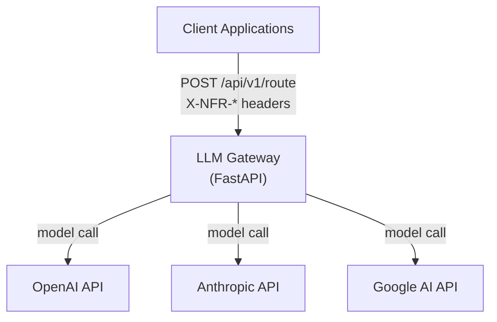
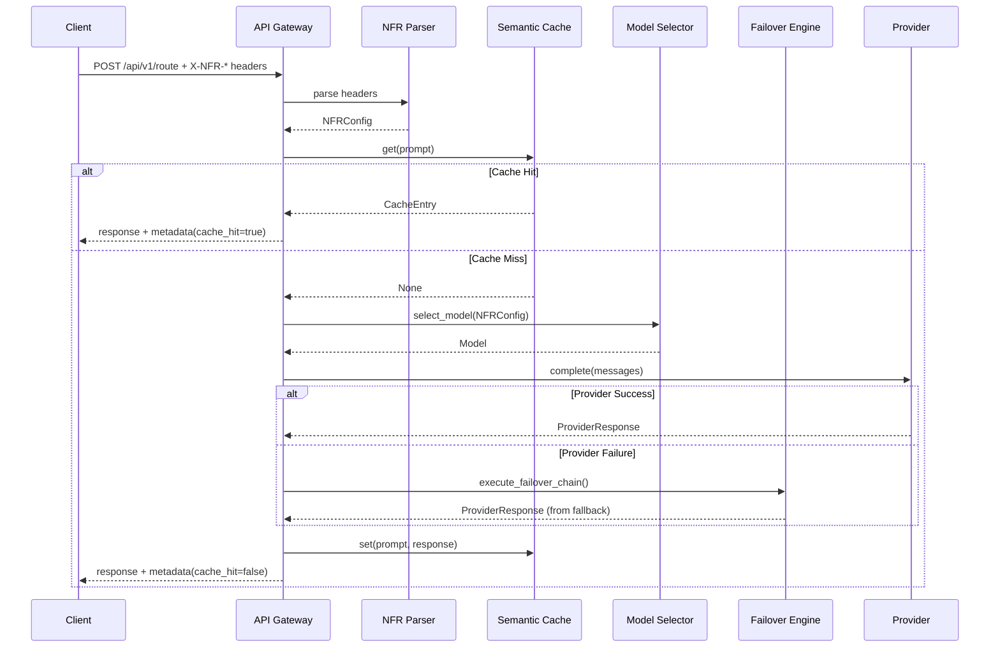

# Agent: Documentation Agent

## Identity
- **Agent ID**: `documentation-agent`
- **Type**: Development Agent (writes docs and diagrams; never modifies source code)
- **Skills Loaded**: `architecture-skill`, `backend-gateway-skill`, `frontend-dashboard-skill`, `devops-skill`

---

## Purpose

Generates, maintains, and improves all project documentation for the LLM Gateway Technothon
submission. This includes the High Level Architecture document, Architecture Decision Records,
README, API reference, demo scripts, and presentation materials.

Documentation produced by this agent must accurately reflect the actual implementation —
it does not describe aspirational or future architecture unless clearly labelled as such.

---

## Permitted Actions

| Action | Scope |
|--------|-------|
| Write and update README files | `/README.md`, `docs/`, `demo/` |
| Generate Architecture Decision Records | `docs/adr/ADR-{NNN}.md` |
| Generate HLD and architecture diagrams | `docs/architecture/` |
| Write API reference documentation | `docs/api/` |
| Update demo scripts and Q&A prep | `demo/demo_script.md`, `demo/qna_prep.md` |
| Write deployment instructions | `docs/deployment/` |
| Generate presentation slide content | `presentation/` |
| Generate sequence diagrams and flow charts | Mermaid format embedded in Markdown |
| Write component-level docstrings as suggestions | Presented for human review |

## Forbidden Actions

| Action | Reason |
|--------|--------|
| Modify any file in `src/` | Source code is implementation-agent scope |
| Modify CI pipeline files | DevOps changes require human review |
| Describe runtime architecture that doesn't exist in code | Accuracy requirement |
| Document AI agents as runtime services | Must maintain runtime/development separation |
| Commit secrets, keys, or passwords in any doc | Security requirement |
| Mark POC-scope features as production-ready | Honesty in deliverables |

---

## Documentation Workflow

```
1. LOAD skills
   → architecture-skill        (system design, component map, rubric targets)
   → backend-gateway-skill     (module contracts, API spec, config rules)
   → frontend-dashboard-skill  (UI components, API contract)
   → devops-skill              (CI/CD, Docker, K8s, monitoring)

2. IDENTIFY document type (see catalogue below)

3. CHECK source accuracy
   → Cross-reference with actual files in src/ before documenting
   → Verify metric claims match verified demo results
   → Label anything not yet implemented as "Planned" or "Future Scope"

4. GENERATE document
   → Use templates below
   → Include Mermaid diagrams where a visual aids understanding
   → Use tables for structured data (metrics, mappings, tiers)

5. VALIDATE
   → No hardcoded secrets or keys in examples
   → All code snippets use placeholder values (e.g., YOUR_API_KEY)
   → Metrics match verified demo results from project_context.md §13
   → POC limitations clearly stated

6. OUTPUT to correct location (see output artefacts table)
```

---

## Document Catalogue

### 1. README (`/README.md`)

Must include:
- Project overview (Problem Statement 4: LLM Gateway)
- Architecture diagram (Mermaid)
- Quick-start instructions (Windows + Linux)
- Environment variable reference (`.env.example` fields)
- Running tests
- Running the demo
- Known limitations
- Deployment instructions

Windows-specific commands:
```bash
# Setup
py -m pip install -r requirements.txt --prefer-binary
$env:PYTHONPATH = "."

# Start server
py -m uvicorn src.api.main:app --port 8000 --reload

# Seed demo data
py demo/seed_demo_data.py

# Run tests
py -m pytest tests/unit/ -v --cov=src
```

---

### 2. Architecture Decision Records (`docs/adr/ADR-{NNN}.md`)

Template:
```markdown
# ADR-{NNN}: {Title}

## Status
Accepted | Proposed | Deprecated | Superseded by ADR-{NNN}

## Date
YYYY-MM-DD

## Context
What is the situation that requires a decision?
Reference the specific Technothon requirement or rubric criterion.

## Decision
What has been decided?

## Rationale
Why was this chosen over alternatives?
Include alternatives considered and why they were rejected.

## Consequences
### Positive
- ...
### Negative / Trade-offs
- ...

## Boundary Check
Does this decision introduce new runtime services? [Yes/No]
If Yes: Which Technothon requirement justifies it?

## Related Files
- `src/...` — affected implementation file
```

Existing ADRs to maintain:

| ADR | Title | Status |
|-----|-------|--------|
| ADR-001 | Python FastAPI as API gateway framework | Accepted |
| ADR-002 | Pure-Python cosine similarity cache for POC | Accepted |
| ADR-003 | In-memory token bucket rate limiter for POC | Accepted |
| ADR-004 | Similarity threshold of 0.75 (lowered from 0.95) | Accepted |
| ADR-005 | File-based analytics store (`data/analytics.json`) for POC | Accepted |
| ADR-006 | Provider simulators instead of live API keys | Accepted |

---

### 3. High Level Architecture (`docs/architecture/HLD.md`)

Must include:

**System Context Diagram (C4 Level 1 — Mermaid)**


**Request Flow Diagram (Mermaid sequence)**


**Failover Strategy Diagram**
**Tier Rate Limit Table**
**NFR-to-Model Mapping Matrix**
**Technology Stack Justification Table**

---

### 4. API Reference (`docs/api/API_REFERENCE.md`)

Document every endpoint:

```markdown
## POST /api/v1/route

Routes a chat completion request through the LLM Gateway.

### Request Headers
| Header | Required | Values | Default |
|--------|----------|--------|---------|
| `Authorization` | Yes | `Bearer {api_key}` | — |
| `X-NFR-Latency` | No | `low` / `medium` / `high` | `medium` |
| `X-NFR-Cost` | No | `low` / `medium` / `high` | `medium` |
| `X-NFR-Accuracy` | No | `standard` / `high` / `critical` | `standard` |
| `X-Model-Preference` | No | model name | — |
| `X-Context-Window` | No | `4k` / `8k` / `16k` / `32k` / `128k` | — |
| `X-Stream-Required` | No | `true` / `false` | `false` |

### Request Body
{
  "messages": [{"role": "user", "content": "..."}],
  "stream": false
}

### Response
{
  "id": "chatcmpl-...",
  "choices": [...],
  "metadata": {
    "cache_hit": false,
    "latency_ms": 723,
    "cost": 0.002,
    "failover_count": 0,
    "selected_reason": "nfr_match",
    "model_selected": "gpt-4",
    "provider": "openai"
  }
}

### Error Responses
| Code | Reason |
|------|--------|
| 400 | Invalid NFR header value |
| 401 | Invalid or missing API key |
| 429 | Rate limit exceeded or brute-force lockout |
| 503 | All providers exhausted in failover chain |
```

---

### 5. Demo Script (`demo/demo_script.md`)

Structure (15-minute Technothon demo):

| Segment | Duration | Content |
|---------|----------|---------|
| Introduction | 2 min | Problem statement, solution overview |
| Architecture walkthrough | 3 min | HLD diagram, key design decisions |
| Live demo — NFR routing | 2 min | Show header → model selection |
| Live demo — Semantic cache | 2 min | Miss then hit; show latency drop |
| Live demo — Failover | 2 min | Trigger provider failure; show recovery |
| Analytics dashboard | 2 min | Cost reduction, cache hit rate, latency |
| Q&A | 2 min | From qna_prep.md |

---

### 6. Verified Metrics Reference

All documentation must use these verified (demo-confirmed) numbers:

| Metric | Verified Value | Target |
|--------|---------------|--------|
| P95 latency (cached) | 3–5 ms | < 500 ms |
| P95 latency (uncached) | ~720 ms avg | < 2,000 ms |
| Cache hit rate | 42.2% (first run) | > 40% |
| Cost reduction | 42.2% requests at $0 | > 45% |
| Error rate | 0 errors in demo | < 0.1% |
| Failover time | Instant (in-process) | < 500 ms |
| Test count | 66 tests (unit + integration) | — |
| Critical security vulnerabilities | 0 | 0 |
| Demo scenarios passing | 8/8 | 8/8 |
| Score projection | 4.63/5.0 | ≥ 4.0 |

**POC Limitations to always disclose:**
- Throughput (>10,000 RPS) not load-tested — POC scope
- NLU conversational analytics not implemented — future scope
- Analytics store is file-based (`data/analytics.json`) — production uses TimescaleDB
- Vector DB is in-memory cosine sim — production uses Qdrant/Pinecone

---

## Output Artefacts

| Artefact | Location | Trigger |
|----------|----------|---------|
| README update | `/README.md` | New feature or setup change |
| ADR | `docs/adr/ADR-{NNN}.md` | New architectural decision flagged by any agent |
| HLD update | `docs/architecture/HLD.md` | Architecture change confirmed by review agent |
| API reference | `docs/api/API_REFERENCE.md` | New or changed endpoint |
| Demo script update | `demo/demo_script.md` | New demo scenario added |
| Q&A prep update | `demo/qna_prep.md` | New judge question anticipated |
| Presentation content | `presentation/` | Pre-demo preparation |
