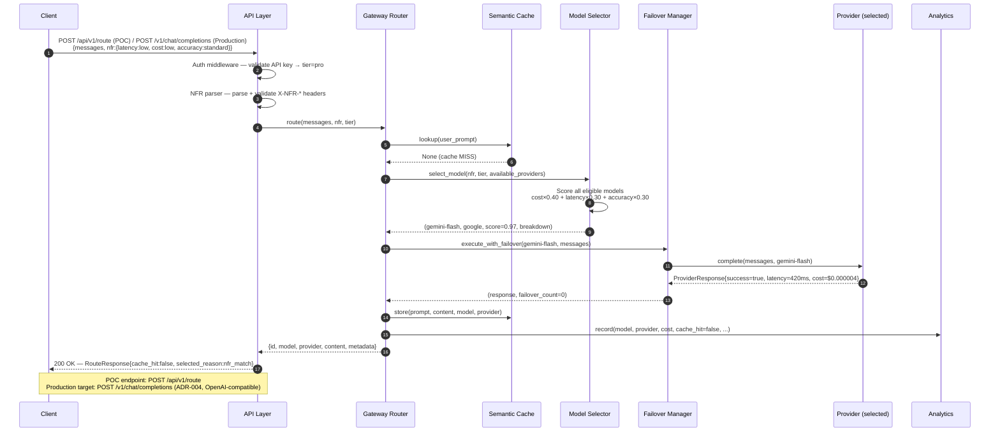
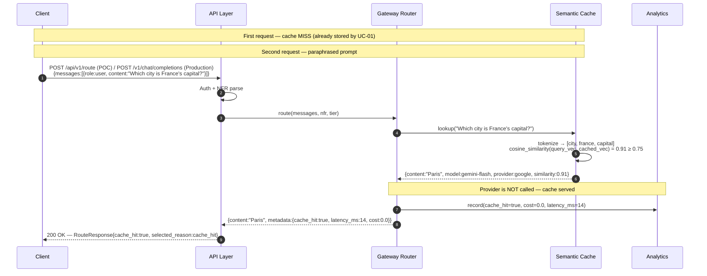
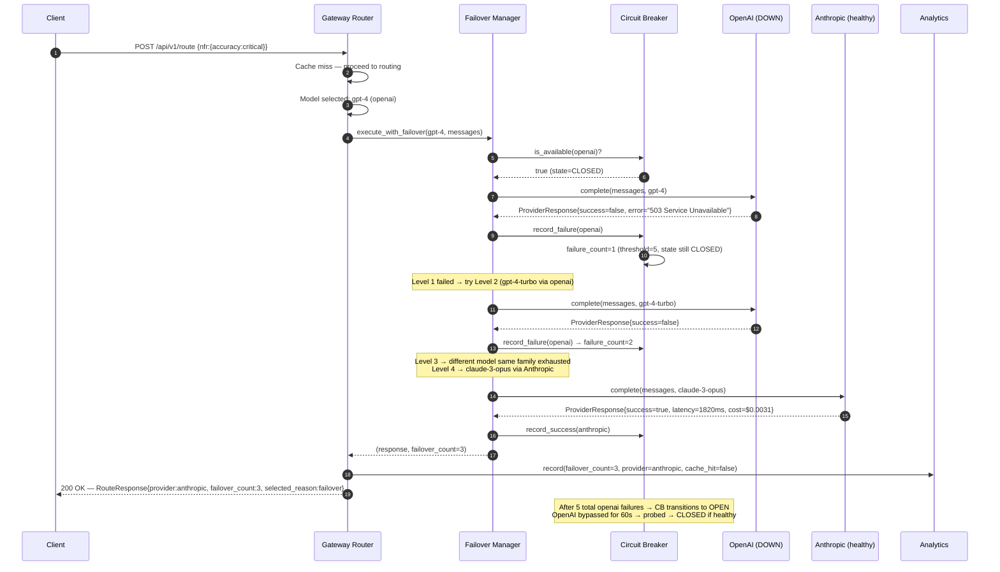
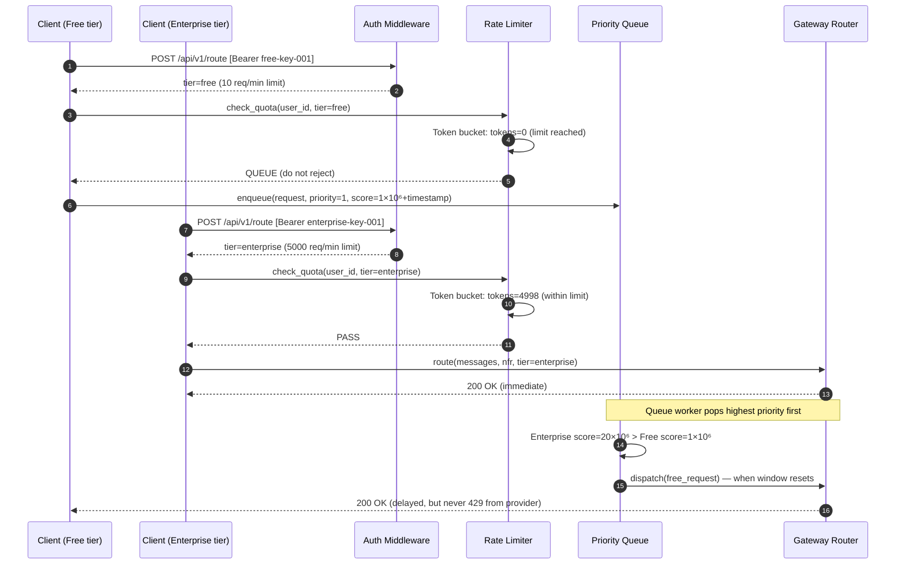

# 06 — High Level Design (HLD)
**Propeller Technothon | Problem Statement 4: LLM Gateway**

---

## 1. System Context

```
┌─────────────────────────────────────────────────────────────────┐
│                        Client Applications                       │
│         Web Apps · Backend Services · CLI Tools · SDKs          │
└──────────────────────────────┬──────────────────────────────────┘
                               │ HTTPS REST / WebSocket
                               ▼
┌─────────────────────────────────────────────────────────────────┐
│                      LLM GATEWAY PLATFORM                        │
│                                                                  │
│  ┌─────────────┐  ┌──────────────┐  ┌──────────────────────┐   │
│  │  API Layer  │→ │   Routing    │→ │   LLM Providers      │   │
│  │  (FastAPI)  │  │   Engine     │  │ OpenAI·Anthropic      │   │
│  └─────────────┘  └──────┬───────┘  │ Google·Azure         │   │
│                          │          └──────────────────────┘   │
│              ┌───────────┴───────────┐                          │
│              ▼                       ▼                          │
│  ┌───────────────────┐  ┌────────────────────────┐             │
│  │  Semantic Cache   │  │  Request Queue &        │             │
│  │  Pure-Python(POC) │  │  Rate Limiter           │             │
│  │  Qdrant(Prod)     │  │  In-Memory(POC)         │             │
│  │                   │  │  Redis(Prod)            │             │
│  └───────────────────┘  └────────────────────────┘             │
│                                                                  │
│  ┌─────────────────────────────────────────────────────────┐   │
│  │   Analytics Engine (JSON/POC · TimescaleDB/Production)    │   │
│  │         Dashboard · Cost Tracker · NLU Chat (Future)     │   │
│  └─────────────────────────────────────────────────────────┘   │
└─────────────────────────────────────────────────────────────────┘
```

---

## 2. Component Architecture

### 2.1 API Layer (`src/api/`)

| Component | Technology | Responsibility |
|-----------|-----------|----------------|
| HTTP Server | FastAPI (Python 3.11) | Async request handling, OpenAI-compatible API surface |
| Auth Middleware | JWT + API Key | Authenticate, identify user + tier |
| NFR Middleware | Custom header parser | Extract X-NFR-Latency, X-NFR-Cost, X-NFR-Accuracy |
| Rate Limit Middleware | In-Memory Token Bucket (POC) / Redis Token Bucket (Production) | Enforce per-tier request limits (ADR-002) |
| Request Models | Pydantic v2 | Schema validation and serialization |

### 2.2 Routing Engine (`src/gateway/`)

| Component | Technology | Responsibility |
|-----------|-----------|----------------|
| NFR Parser | Python | Parse headers → structured NFR object |
| Model Selector | Python (scoring algorithm) | Rank models by NFR weights: Cost 40%, Latency 30%, Accuracy 30% |
| Failover Manager | Python + Redis | 4-level failover, exponential backoff, circuit breaker |
| Circuit Breaker | Redis state machine | CLOSED → OPEN (5 fails) → HALF-OPEN (probe) → CLOSED |

### 2.3 Semantic Cache (`src/cache/`)

| Component | Technology | Responsibility |
|-----------|-----------|----------------|
| L1 Hot Cache | **POC:** In-memory dict / **Production:** Redis (hash) | Exact prompt hash lookup, <5ms |
| L2 Vector Cache | **POC:** Pure-Python cosine similarity / **Production:** Qdrant | Cosine similarity search, threshold **0.75** (ADR-003) |
| Embedding Service | **POC:** Python tokeniser (word overlap) / **Production:** OpenAI Ada-002 (1536-dim vectors) | Prompt vectorisation for similarity matching |
| Cache Manager | Python | TTL enforcement (7 days), LRU eviction, invalidation |

> ⚠️ **ADR-003 (POC):** Semantic cache implemented as pure-Python cosine similarity — no Qdrant or Ada-002 dependency. Enables zero-cost, zero-infrastructure demo execution. Production path: Qdrant L2 + Ada-002 embeddings for production-grade semantic fidelity.

> ⚠️ **ADR-003:** Similarity threshold = **0.75**. Original design value of 0.95 was too strict — empirical testing produced 0% cache hits. Reduced to 0.75 after demo validation. Verified cache hit rate: **42.2%**.

### 2.4 Provider Layer (`src/providers/`)

| Component | Technology | Responsibility |
|-----------|-----------|----------------|
| Base Provider | Python ABC | Abstract interface: `complete()`, `health_check()`, `estimate_cost()` |
| OpenAI Provider | openai SDK | GPT-4, GPT-4-Turbo, GPT-3.5-Turbo, GPT-4o |
| Anthropic Provider | anthropic SDK | Claude 3 Opus, Sonnet, Haiku |
| Google Provider | google-generativeai | Gemini Pro, Gemini Ultra |
| Azure Provider | openai SDK (Azure) | GPT-4 on Azure OpenAI |

### 2.5 Queue & Rate Limiter

> ⚠️ **ADR-002 — POC vs. Production:**
> POC uses an **in-memory token bucket** with no Redis dependency, enabling zero-infrastructure demo execution.
> Production target uses Redis INCR + TTL for distributed rate limiting across multiple gateway instances.

| Component | POC Technology | Production Technology | Responsibility |
|-----------|---------------|----------------------|----------------|
| Rate Limiter | In-memory token bucket (Python dict) | Redis INCR + TTL | Token bucket per user per 60s window |
| Priority Queue | In-memory heapq | Redis Sorted Set (score = tier_priority × 1M + timestamp) | Fair queuing by tier |
| Queue Worker | Inline dispatch | Python RQ workers | Dequeues and dispatches to routing engine |
| Dead Letter Queue | Not implemented (POC) | Redis List | Stores permanently failed requests |

### 2.6 Analytics Engine (`src/analytics/`)

| Component | Technology | Responsibility |
|-----------|-----------|----------------|
| Metrics Collector | Python + `data/analytics.json` **(POC)** / TimescaleDB **(Production)** | Per-request: cost, latency, model, cache_hit, provider |
| Dashboard API | FastAPI `GET /v1/analytics/summary` | Serves aggregated metrics as JSON (POC); React frontend (Production) |
| NLU Interface | Future Scope (ADR-007) | Classifies query intent → SQL → results |
| Time-Series Store | `data/analytics.json` **(POC)** / TimescaleDB **(Production)** | Optimised time-range analytics |

> ⚠️ **ADR-010 — POC vs. Production:** Analytics implemented as a JSON file store (`data/analytics.json`) for POC portability — no database dependency. Production target: TimescaleDB hypertable with the schema defined in Section 3.1 below.

---

## 3. Data Architecture

### 3.1 PostgreSQL Schema (Core Tables)

```sql
-- Model catalog
CREATE TABLE models (
    id          UUID PRIMARY KEY,
    name        VARCHAR(100) UNIQUE,
    provider    VARCHAR(50),
    family      VARCHAR(50),
    cost_per_1k_tokens DECIMAL(10,6),
    avg_latency_ms     INTEGER,
    max_context_tokens INTEGER,
    capabilities       JSONB
);

-- Users and tiers
CREATE TABLE users (
    id          UUID PRIMARY KEY,
    api_key_hash VARCHAR(64) UNIQUE,
    tier        VARCHAR(20) CHECK (tier IN ('free','basic','pro','enterprise')),
    daily_token_quota    BIGINT,
    created_at  TIMESTAMPTZ DEFAULT NOW()
);

-- Request log (TimescaleDB hypertable) — PRODUCTION TARGET (ADR-010)
-- POC uses data/analytics.json; this schema is the production migration target
CREATE TABLE requests (
    id          UUID,
    user_id     UUID REFERENCES users(id),
    model_id    UUID REFERENCES models(id),
    provider    VARCHAR(50),
    prompt_tokens       INTEGER,
    completion_tokens   INTEGER,
    cost                DECIMAL(10,6),
    latency_ms          INTEGER,
    cache_hit           BOOLEAN,
    failover_count      INTEGER,
    nfr_latency         VARCHAR(10),
    nfr_cost            VARCHAR(10),
    nfr_accuracy        VARCHAR(10),
    created_at  TIMESTAMPTZ DEFAULT NOW()
);
SELECT create_hypertable('requests', 'created_at');

-- Routing rules
CREATE TABLE routing_rules (
    id          UUID PRIMARY KEY,
    name        VARCHAR(100),
    conditions  JSONB,   -- e.g. {"nfr_accuracy": "critical"}
    actions     JSONB,   -- e.g. {"prefer_models": ["gpt-4", "claude-opus"]}
    priority    INTEGER,
    enabled     BOOLEAN DEFAULT TRUE
);

-- Provider health
CREATE TABLE provider_health (
    provider        VARCHAR(50) PRIMARY KEY,
    status          VARCHAR(20),  -- healthy | degraded | down
    circuit_state   VARCHAR(20),  -- CLOSED | OPEN | HALF_OPEN
    avg_latency_ms  INTEGER,
    error_rate      DECIMAL(5,2),
    last_checked    TIMESTAMPTZ
);
```

### 3.2 Redis Key Schema

| Key Pattern | Type | TTL | Purpose |
|-------------|------|-----|---------|
| `ratelimit:{user_id}:{window}` | String (INCR) | 60s | Token bucket counter *(Production only — ADR-002; POC uses in-memory dict)* |
| `cache:hash:{prompt_hash}` | Hash | 24h | L1 hot cache |
| `queue:{tier}` | Sorted Set | — | Priority request queue |
| `cb:{provider}` | Hash | — | Circuit breaker state |
| `provider:health:{provider}` | Hash | 35s | Health check cache |

### 3.3 Qdrant Vector Schema

```json
{
  "collection": "semantic_cache",
  "vectors": { "size": 1536, "distance": "Cosine" },
  "payload_schema": {
    "prompt_hash":    "keyword",
    "model":          "keyword",
    "provider":       "keyword",
    "created_at":     "datetime",
    "ttl_expires_at": "datetime",
    "hit_count":      "integer"
  }
}
```

---

## 4. Request Lifecycle

```
Client Request
    │
    ▼
[1] API Layer — Auth → NFR Parse → Validate
    │
    ▼
[2] Rate Limiter — Token bucket check
    ├── PASS → continue
    └── FAIL → enqueue (priority queue)
    │
    ▼
[3] Semantic Cache — Embedding → Qdrant search
    ├── HIT (cosine ≥ 0.95) → return cached response
    └── MISS → continue
    │
    ▼
[4] Model Selector — Score models by NFR weights
    │ → Select top-scoring available model
    ▼
[5] Provider Dispatch — Call selected provider
    ├── SUCCESS → cache response → return
    └── FAILURE → Failover Engine
         ├── Level 1: Same model, different provider
         ├── Level 2: Same model, different region
         ├── Level 3: Different model, same family
         └── Level 4: Different model, different family
    │
    ▼
[6] Response — Enrich with metadata → return to client
    │
    ▼
[7] Analytics — Async log
    - POC:        Append to data/analytics.json (ADR-010)
    - Production: Insert into TimescaleDB hypertable
```

---

## 5. Technology Stack Summary

| Layer | Technology | Version | Justification |
|-------|-----------|---------|---------------|
| API Framework | Python FastAPI | 0.110+ | Async, auto OpenAPI docs, AI ecosystem |
| Queue | Redis + RQ | Redis 7 | Dual-use: cache L1 + queue |
| Vector DB | Qdrant | 1.8+ | Open-source, Docker, Python SDK |
| Relational DB | PostgreSQL | 15+ | JSONB, TimescaleDB extension *(Production — ADR-010)* |
| Time-Series | **POC:** JSON file / **Production:** TimescaleDB | 2.14+ | POC: `data/analytics.json`; Production: reuses PostgreSQL engine |
| Frontend | React 18 + MUI *(Production — Path B only)* | React 18 | Rapid UI, widest ecosystem. **Not implemented in POC** — analytics via REST API (ADR-007) |
| Monitoring | Prometheus + Grafana | Latest | Open-source, Docker-friendly |
| Containers | Docker Compose | V2 | Simple local orchestration |

---

## 6. CI/CD Pipeline

```
Push to main
    │
    ▼
[GitHub Actions CI]
  ├── Lint (ruff + mypy)
  ├── Unit tests (pytest)
  ├── Integration tests (pytest + Docker services)
  ├── Security scan (bandit + safety)
  └── Coverage check (≥ 85%)
    │
    ▼ (on tag / release branch)
[GitHub Actions CD]
  ├── Build Docker image
  ├── Push to registry
  └── Deploy (docker-compose pull + up)
```

---

## 7. Deployment Architecture (POC)

```
Docker Compose (single host)
├── gateway       (FastAPI, port 8000)
├── postgres      (PostgreSQL + TimescaleDB, port 5432)
├── redis         (Redis 7, port 6379)
├── qdrant        (Qdrant, port 6333)
├── frontend      (React, port 3000) ── ⚠️ Production Path B only (not in POC)
├── prometheus    (port 9090)
└── grafana       (port 3001)
```

**Production Path (K8s):**
- EKS / GKE with HPA (CPU + RPS based autoscaling)
- Redis Cluster for HA
- Qdrant cluster (3 nodes)
- PostgreSQL RDS with read replicas
- Secrets in AWS Secrets Manager / HashiCorp Vault

---

## 8. Sequence Diagrams

### 8.1 UC-01 — NFR-Based Model Selection (Cache Miss)



---

### 8.2 UC-02 — Semantic Cache Hit



---

### 8.3 UC-03 — Multi-Level Failover with Circuit Breaker



---

### 8.4 UC-04 — Tier-Based Rate Limiting & Priority Queue


