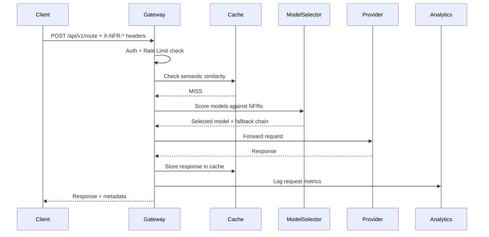
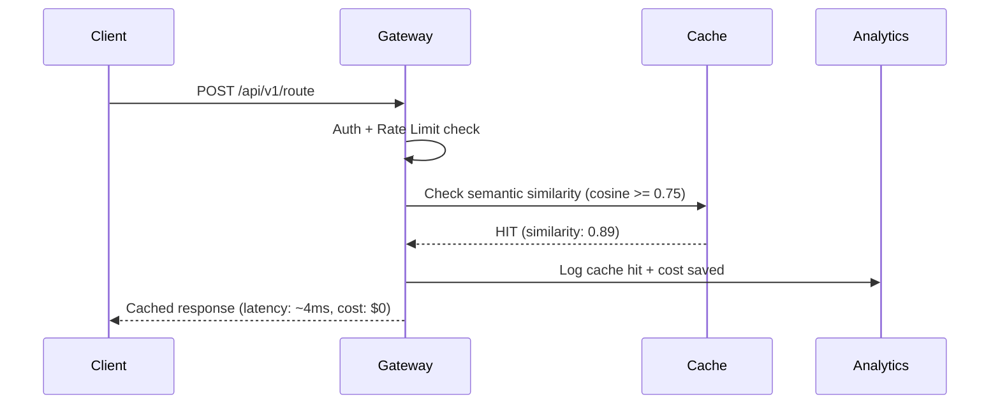
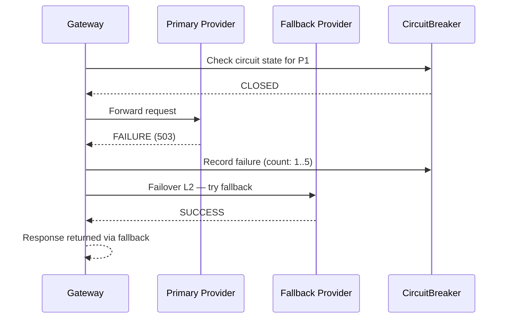

# High Level Architecture — LLM Gateway Platform

> Status: Draft | Version: 1.0

---

## System Overview

The LLM Gateway Platform is an intelligent middleware layer that routes, caches, queues, and monitors requests to multiple LLM providers.

---

## Component Diagram

```
┌──────────────────────────────────────────────────────────────┐
│                      Client Applications                      │
│              (Web Apps · Services · CLI Tools)                │
└────────────────────────────┬─────────────────────────────────┘
                             │ REST / WebSocket
┌────────────────────────────▼─────────────────────────────────┐
│                     API Gateway Layer                         │
│  ┌─────────────┐  ┌──────────────┐  ┌─────────────────────┐  │
│  │    Auth &   │  │  NFR Header  │  │   Rate Limiter &    │  │
│  │ API Key Mgmt│  │   Parser     │  │   Tier Throttling   │  │
│  └─────────────┘  └──────────────┘  └─────────────────────┘  │
└────────────────────────────┬─────────────────────────────────┘
                             │
┌────────────────────────────▼─────────────────────────────────┐
│                    Intelligent Router                          │
│  ┌──────────────────┐  ┌───────────────────────────────────┐  │
│  │  Model Selector  │  │   Failover & Circuit Breaker      │  │
│  │ (NFR Scoring)    │  │   (4-Level Fallback Strategy)     │  │
│  └──────────────────┘  └───────────────────────────────────┘  │
└───────────┬────────────────────────┬────────────────────────── ┘
            │                        │
┌───────────▼──────────┐  ┌──────────▼──────────────────────────┐
│   Semantic Cache      │  │         Request Queue                │
│  ┌────────────────┐  │  │  ┌──────────────┐  ┌─────────────┐  │
│  │ POC:Pure-Py   │  │  │  │ Priority     │  │ Dead Letter │  │
│  │ Prod:Qdrant   │  │  │  │ Queue        │  │ Queue(Prod) │  │
│  │ +Ada-002      │  │  │  └──────────────┘  └─────────────┘  │
│  └────────────────┘  │  └─────────────────────────────────────┘
└──────────────────────┘             │
                                     │
┌────────────────────────────────────▼────────────────────────── ┐
│                      LLM Providers                              │
│  ┌──────────┐  ┌───────────┐  ┌─────────┐  ┌──────────────┐   │
│  │  OpenAI  │  │ Anthropic │  │ Google  │  │ Azure OpenAI │   │
│  └──────────┘  └───────────┘  └─────────┘  └──────────────┘   │
└────────────────────────────────────────────────────────────────┘
            │
┌───────────▼──────────────────────────────────────────────────── ┐
│                    Analytics Engine                              │
│  ┌──────────────┐  ┌────────────────┐  ┌──────────────────────┐ │
│  │  Collector   │  │   Dashboard    │  │  Chat Interface (NLU)│ │
│  │  (Metrics)   │  │   (Real-Time)  │  │  (Conversational)    │ │
│  └──────────────┘  └────────────────┘  └──────────────────────┘ │
└──────────────────────────────────────────────────────────────────┘
```

---

## Data Flow

1. Client sends request with custom `X-NFR-*` headers
2. API Gateway authenticates and parses NFR requirements
3. Rate limiter checks tier quota — queues if exceeded
4. Semantic cache checks for similar cached prompt (cosine ≥ **0.75**, ADR-003)

   > ⚠️ **ADR-003:** Threshold = 0.75. Original design value of 0.95 was empirically found to produce 0% cache hits. Reduced to 0.75 after demo validation. Verified hit rate: **42.2%**.

   - **Cache HIT** → return cached response immediately
   - **Cache MISS** → proceed to routing
5. Model Selector scores available models against NFR requirements
6. Request dispatched to selected provider
7. On failure → Failover engine triggers next level fallback
8. Response cached and returned to client
   - **POC:** Pure-Python cosine similarity store (in-memory, ADR-003)
   - **Production:** Ada-002 embedding stored in Qdrant vector DB
9. Metrics collected and stored in analytics engine

---

## NFR Routing Logic

```
X-NFR-Latency:  low | medium | high
X-NFR-Cost:     low | medium | high
X-NFR-Accuracy: standard | high | critical

Scoring (weighted):
  Latency  → 30%
  Cost     → 40%
  Accuracy → 30%
```

---

## Failover Levels

```
Level 1 → Same model, different provider
Level 2 → Same model, different region
Level 3 → Different model, same family
Level 4 → Different model, different family
Circuit Breaker → Opens after 5 failures / 60s timeout
```

---

---

## Sequence Diagrams

> Detailed sequence diagrams for each use case are maintained in `docs/06-HLD.md` (Section 4) to avoid duplication. The diagrams below are high-level summaries.

### Happy Path (Cache MISS → Provider Call)



### Cache HIT Path



### Failover Path



> For full sequence diagrams including circuit breaker state transitions, rate limiting flows, and analytics collection, see `docs/06-HLD.md` Section 4.
